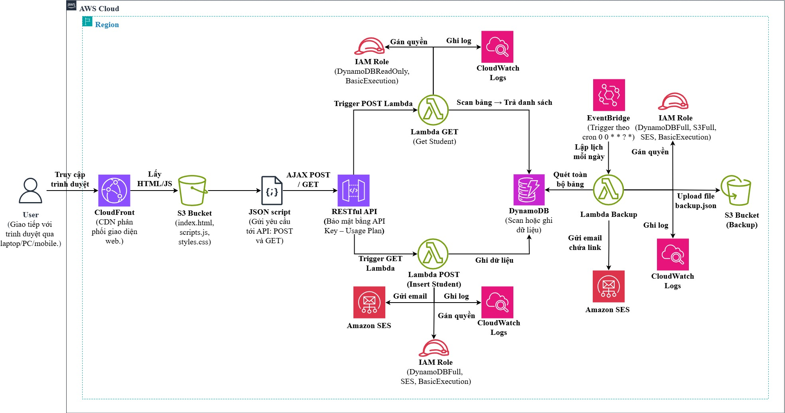

<p align="center">
	
</p>

# 🏁Workshop: Triển Khai Website Serverless Quản Lý Thông Tin Sinh Viên với AWS 🚀

  

Chào mừng bạn đến với **Workshop: Triển Khai Website Serverless Quản Lý Thông Tin Sinh Viên với AWS**! Đây là một chương trình đào tạo thực hành kéo dài **8 giờ**, giúp bạn xây dựng một **ứng dụng web serverless** quản lý thông tin sinh viên trên nền tảng **Amazon Web Services (AWS)**. Sử dụng các dịch vụ như **S3**, **CloudFront**, **API Gateway**, **Lambda**, **DynamoDB**, **SES**, và **EventBridge**, bạn sẽ học cách triển khai một hệ thống hoàn chỉnh từ giao diện tĩnh đến backend, tích hợp sao lưu tự động và giám sát hiệu suất.

<p align="center">
  <a href="https://nguyentribaothang.github.io/" rel="dofollow" target="blank"><strong>Explore the docs »</strong></a>
<p>
	

### 🔰Giới Thiệu


🧠Workshop này được thiết kế để trang bị kỹ năng thực tiễn về **kiến trúc serverless** và **điện toán đám mây** cho lập trình viên, sinh viên CNTT, và chuyên gia IT. Qua **12 phần thực hành**, bạn sẽ:
- Xây dựng giao diện web tĩnh với **Tailwind CSS** để quản lý thông tin sinh viên.
- Tích hợp backend serverless với **AWS Lambda**, **API Gateway**, và **DynamoDB**.
- Thiết lập sao lưu tự động vào **S3** và gửi thông báo qua **SES** với **EventBridge**.
- Giám sát hệ thống bằng **CloudWatch** và dọn dẹp tài nguyên để tối ưu chi phí.

Workshop phù hợp cho các tổ chức giáo dục, trung tâm đào tạo, và doanh nghiệp muốn nâng cao năng lực công nghệ đám mây. Sau khi hoàn thành, bạn sẽ có một **dự án thực tế** để bổ sung vào portfolio và kỹ năng triển khai ứng dụng serverless chuyên nghiệp.


### Thông Tin Sinh Viên Thực Tập 👨‍🎓


### 🧑‍🎓Thành Viên 1
- **📛Họ và Tên**: Nguyễn Tri Bão Thắng  
- **🏫Trường**: Trường Đại Học Công nghệ Thành phố Hồ Chí Minh (HUTECH)  
- **🆔MSSV**: 2180601452  
- **📧Gmail**: [nguyentribaothang@gmail.com](mailto:nguyentribaothang@gmail.com)  
- **💻GitHub**: [NguyenTriBaoThang](https://github.com/NguyenTriBaoThang)  

### 🧑‍🎓Thành Viên 2
- **📛Họ và Tên**: Võ Thành Trung  
- **🏫Trường**: Trường Đại Học Công nghệ Thành phố Hồ Chí Minh (HUTECH)  
- **🆔MSSV**: 2180603167  
- **📧Gmail**: [vothanhtrung9379@gmail.com](mailto:vothanhtrung9379@gmail.com)  
- **💻GitHub**: [ttrung03](https://github.com/ttrung03)  


### 🧩Nội Dung Chính


📦Workshop bao gồm **12 phần thực hành**, từ giới thiệu serverless đến triển khai và dọn dẹp tài nguyên:

| 📚Phần | 📌Nội Dung | 📝Mô Tả |
|------|----------|-------|
| 1 | **📖Giới Thiệu** | Tổng quan serverless, lợi ích, và kiến trúc hệ thống. |
| 2 | **⚙️Chuẩn Bị** | Thiết lập tài khoản AWS, AWS CLI, và môi trường phát triển. |
| 3 | **🧠Cấu Hình Lambda** | Tạo Lambda functions để xử lý logic quản lý sinh viên. |
| 4 | **🔗Tạo API** | Cấu hình API REST với API Gateway, tích hợp Lambda. |
| 5 | **🎨Giao Diện Web** | Thiết kế giao diện tĩnh với Tailwind CSS. |
| 6 | **🪣Cấu Hình S3** | Tạo S3 bucket lưu trữ giao diện và dữ liệu sao lưu. |
| 7 | **🌍Triển Khai CloudFront** | Phân phối giao diện qua CloudFront với độ trễ thấp. |
| 8 | **💾Sao Lưu Tự Động** | Thiết lập sao lưu DynamoDB vào S3 với EventBridge, gửi email qua SES. |
| 9 | **🧪Kiểm Tra Kết Quả** | Xác minh hoạt động của giao diện, API, và sao lưu. |
| 10 | **🔍Giám Sát CloudWatch** | Phân tích log hệ thống với CloudWatch Logs Insights. |
| 11 | **🎬Video Demo** | Xem video minh họa quy trình triển khai (35 phút). |
| 12 | **🧹Dọn Dẹp Tài Nguyên** | Xóa tài nguyên để tránh chi phí dư thừa. |

**🛠️Công Cụ Sử Dụng**:
- **🖥️AWS Management Console**, **AWS CLI**: Cấu hình dịch vụ AWS.
- **💻Visual Studio Code**: Viết mã HTML/CSS/JS.
- **🎨Tailwind CSS**: Thiết kế giao diện.
- **📬Postman**: Kiểm tra API.
- **⚙️Node.js**: Quản lý thư viện JavaScript.
- **🔎CloudWatch Logs Insights**: Phân tích log.


### 🚀Hướng Dẫn Cài Đặt và Chạy Dự Án


### 🔽1. Clone Mã Nguồn từ GitHub
Mở terminal và chạy lệnh sau để sao chép mã nguồn về máy:

```bash
git clone https://github.com/NguyenTriBaoThang/NguyenTriBaoThang.github.io.git
cd NguyenTriBaoThang.github.io
```

### 🧰2. Cài Đặt Công Cụ
- **AWS CLI**: Cài đặt theo hướng dẫn tại [https://aws.amazon.com/cli/](https://aws.amazon.com/cli/).
- **Node.js**: Tải và cài đặt từ [https://nodejs.org/](https://nodejs.org/) để sử dụng Tailwind CSS.
- **Visual Studio Code**: Tải tại [https://code.visualstudio.com/](https://code.visualstudio.com/) để chỉnh sửa mã.
- **Postman**: Tải tại [https://www.postman.com/downloads/](https://www.postman.com/downloads/) để kiểm tra API.

### 🔐3. Cấu Hình Môi Trường AWS
- Tạo tài khoản AWS tại [https://aws.amazon.com/](https://aws.amazon.com/) (sử dụng vùng `us-east-1`).
- Cấu hình AWS CLI:
  ```bash
  aws configure
  ```
  Nhập **Access Key**, **Secret Key**, vùng (`us-east-1`), và định dạng đầu ra (`json`).

### 🌐4. Triển Khai Trang Web Tĩnh
- Tải các tệp `index.html`, `styles.css`, `scripts.js` từ thư mục repository lên S3 bucket `student-management-website-2025`.
- Cấu hình S3 bucket với Static Website Hosting (xem hướng dẫn chi tiết trong workshop, Phần 6).
- Truy cập giao diện web qua URL CloudFront sau khi cấu hình (Phần 7).

### 🧪5. Chạy và Kiểm Tra Dự Án
- Mở `index.html` cục bộ trong trình duyệt để kiểm tra giao diện tĩnh:
  ```bash
  open index.html  # macOS
  start index.html  # Windows
  ```
- Kiểm tra endpoint API với Postman (GET/POST `/students`, POST `/backup`).
- Xem video demo (Phần 11) để hiểu quy trình triển khai.


### 🧱Yêu Cầu Hệ Thống


| ⚙️Yêu Cầu | 💡Mô Tả |
|---------|-------|
| **💻Hệ Điều Hành** | Windows, macOS, hoặc Linux |
| **☁️AWS Account** | Tài khoản AWS Free Tier (khuyến nghị) |
| **🔧Công Cụ** | AWS CLI, Node.js (v16+), Visual Studio Code, Postman |
| **🌐Trình Duyệt** | Chrome, Firefox, hoặc Edge (hỗ trợ JavaScript) |
| **📶Kết Nối** | Internet ổn định để truy cập AWS và GitHub |


### 📚Tài Liệu Tham Khảo 


- [🔗The First Cloud Journey](https://cloudjourney.awsstudygroup.com/)
- [🌟AWS Special Force Portal](https://specialforce.awsstudygroup.com/)
- [🧠AWS Serverless Workshops](https://aws.amazon.com/serverless/)
- [📖AWS Documentation](https://docs.aws.amazon.com/)
- [🎨Tailwind CSS](https://tailwindcss.com/)
- [☁️VTI Cloud](https://vticloud.io/)


### 📬Liên Hệ

Có thắc mắc hoặc cần hỗ trợ? Liên hệ với chúng tôi:
- **📧Nguyễn Tri Bão Thắng**: [nguyentribaothang@gmail.com](mailto:nguyentribaothang@gmail.com)
- **📧Võ Thành Trung**: [vothanhtrung9379@gmail.com](mailto:vothanhtrung9379@gmail.com)

🌟 **Cảm ơn bạn đã quan tâm đến workshop của chúng tôi!** Tham gia để làm chủ công nghệ serverless và xây dựng ứng dụng hiện đại với AWS! 🚀

### 💖Contributor

<p align="justify">

🧑‍💻 Thanks goes to these wonderful people ([emoji key](https://allcontributors.org/docs/en/emoji-key))

</p>

<div align="center">
	<table>
		<tr>
			<td align="center" valign="top">
				
			        <br>
			        <a href="https://github.com/NguyenTriBaoThang">Bao Thang</a>
			        <p>
			          <a href="https://github.com/NguyenTriBaoThang/NguyenTriBaoThang.github.io/commits?author=NguyenTriBaoThang" title="Developer">💻</a>
			        </p>
			</td>
			<td align="center" valign="top">
				
			        <br>
			        <a href="https://github.com/ttrung03">Thanh Trung</a>
			        <p>
			          <a href="https://github.com/ttrung03/NguyenTriBaoThang.github.io/commits?author=ttrung03" title="Developer">💻</a>
			        </p>
			</td>
		</tr>
	</table>
</div>


### 📄License


<p align="justify">

This project is licensed under the terms of the [MIT](LICENSE) license.

</p>
